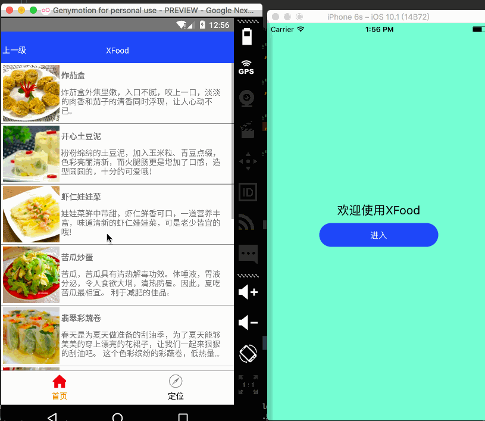

## XFood

### 这是我业余时间，自学RN时写的一个app

#### 先看下效果图：



#### 同时能运行在android跟ios设备，开发起来也很快，主要用到的知识有：

  * 自定义Button，titleBar，属性传值
  * 界面跳转Navigator
  * 菜谱列表ListView
  * 详情页需要滚动，使用ScrollView
  * 官方提供的Tabbar不能跨平台，第三方组件react-native-xtabbar的引入以及使用
  * 详情页的布局列表技巧
  * 方法调用，采用箭头表示法，没有使用Bind(this)

#### 其他知识梳理：
  * 给组件包装导航Navigator实现跳转

```

import  Mainpager from  './Mainpager';

export default class XFoodMain extends Component {

    render() {
        var defaultName = 'Mainpager';
        var defaultComponent = Mainpager;
        return (
            <Navigator
                initialRoute={
                    {
                        name:defaultName,
                        component: defaultComponent,
                    }
                }
                configureScene={
                    ()=>{
                          return Navigator.SceneConfigs.HorizontalSwipeJump;
                    }
                }
                renderScene={

                    (route,navigator)=>{
                    let Com=route.component;
                    return <Com {...route.params}  navigator={navigator} />;
                }
                }>
            </Navigator>
        );
    }
```
>说明：首先在XFoodMain这个类中想引入其他组件，就可以通过`import  Mainpager from  './Mainpager';`的方式引入，其中`'./XXX'`
表示在同一级目录，如果是上一级就可以这样表示：`'../XXX'`; Navigator组件的使用也入上所示，重要方法有3个，分别是初始化路由`initialRoute`、配置跳转时的动画`configureScene`、还有最后一个非常重要的方法`renderScene`，需要
注意的是，在返回Component的同时需要携带两个参数过去，即route.params、navigator。前者是在界面的跳转的时候可以传递参数，后者是来控制界面跳转以及返回

  * 这个界面只有一个按钮，点击进入Home主页

```

import  Button from '../../widget/Button';
import  AllKindsFood from '../allkindsFood/AllKindsFood';

export default class Mainpager extends Component {
    // 构造
    constructor(props) {
        super(props);
        // 初始状态
        this.state = {
            navigator: null,
        };
    }
    comeIn = () => {
        if(this.state.navigator){
            this.state.navigator.push({
                name: 'AllKindsFood',
                component: AllKindsFood,
                params: {
                    title: 'wtf',
                    name: 'hehda',
                },
            })
        }

    };
    render() {
        return (
            <View style={styles.container}>
                <Text style={styles.welcome}>
                    欢迎使用XFood
                </Text>
                <Button ref="button" text={"进入"} button_bg={"#1c4ef2"} onclick={this.comeIn}/>
            </View>
        );
    }
    componentDidMount() {
        var {navigator} =this.props;
        this.setState(
            this.state = {
            navigator: navigator,
        });
    }
}
```
> 在XFoodMain中已经给Mainpager包装导航了，所以在这里就可以通过`var {navigator} =this.props;`解构的方式拿到navigator，当点击按钮的时候，即可通过navigator push到下一个界面
在push的时候，可以携带以下参数，name、component、params。还有一点就是这里自定义的了按钮，并且给按钮自定义了一些属性，如text、button_bg、onclick方法等，在自定义的Button可以通过props拿到这些属性，即传入下去了

  * 这个界面中，包含标题栏、底部Tabbar

```
import TabBar from 'react-native-xtabbar';
import  HomeFoodPager from './HomeFoodPager';
import  TitleBar from '../../widget/TitleBar';

const Dimensions = require('Dimensions');
const {width} = Dimensions.get('window');
const {height} = Dimensions.get('window');

export default class AllKindsFood extends Component {
    // 构造
    constructor(props) {
        super(props);
        var {navigator, route}=this.props;
        // 初始状态
        this.state = {
            navigator: navigator,
        };
    }
    render() {
        press = (index) => {
        };
        back = () => {
            var {navigator}=this.props;
            if (navigator != null) {
                navigator.pop();
            }
        };
        return (
            <View style={styles.container}>

                <TitleBar title="XFood" leftTitle="上一级" title_bg="#1c4ef2"/>
                <TabBar
                    style={styles.content}
                    onItemSelected={(index)=>press(index)}
                >
                    <TabBar.Item
                        icon={require('../../image/home_normal.png')}
                        selectedIcon={require('../../image/home_pressed.png')}
                        title='首页'>
                        <HomeFoodPager navigator={this.state.navigator}/>

                    </TabBar.Item>

                    <TabBar.Item
                        icon={require('../../image/find_normal.png')}
                        selectedIcon={require('../../image/find_pressed.png')}
                        title='其他'>
                        <HomeFoodPager navigator={this.state.navigator}/>

                    </TabBar.Item>

                </TabBar>
            </View>
        );
    }
}
```
> TitleBar也是自定义的，跟前面的Button类型，都是自定义一些属性；紧接着是Tabbar，我是引用用第三方的，因为RN原有的组件是不支持跨平台的，引用方式：npm install [第三方库] --save ，如npm install react-native-device-info --save；
然后查看README文档，即可知道如何使用。在点击TabBar的Item时，需要将之前的navigator对象最为属性传递下去

  * 菜谱列表listview

```
import  FoodDetail from './FoodDetial';

const Dimensions = require('Dimensions');
const {width} = Dimensions.get('window');
const {height} = Dimensions.get('window');

const foodJsonData = require('../data/foodData.json');
const ds = new ListView.DataSource({rowHasChanged: (r1, r2) => r1 !== r2});
const url = 'http://api.jisuapi.com/recipe/byclass?classid=2&start=0&num=10&appkey=019edfd7e2c45c72';

export default class HomeFoodPager extends Component {
    // 构造
    constructor(props) {
        super(props);
        // 初始状态
        this.state = {
            dataSource: ds.cloneWithRows(foodJsonData.result.list),
        };
    }
    render() {
        pressItem = (rowData) => {
            const {navigator}=this.props;
            console.log(rowData.name);
            if(navigator!=null){
                navigator.push({
                    name:"FoodDetail",
                    component:FoodDetail,
                    params:{
                        rowData:rowData,
                    }
                })
            }
        };

        renderRowData = (rowData, rowID) => {

            return <TouchableOpacity activeOpacity={0.5}
                                     onPress={()=>pressItem(rowData)}
            >
                <View style={styles.cellStyle}>

                    <Image style={{width:100,height:100}} source={{uri: rowData.pic}}/>

                    <View style={styles.rightStyle}>
                        <Text style={{fontWeight:'bold'}}
                              numberOfLines={1}
                        >
                            {rowData.name }</Text>

                        <Text style={{width:0.7*width, textAlign: 'left',fontWeight:'normal',marginTop:10} }
                              numberOfLines={3}
                        >
                            {rowData.content }</Text>
                    </View>

                </View>
            </TouchableOpacity>
        };

        return (
            <ListView style={styles.container}
                      dataSource={this.state.dataSource}
                      renderRow={(rowData,rowID) => renderRowData(rowData,rowID)}
            />
        )
    }
    //获取网络数据
    componentDidMount() {


        fetch(url).then((response) => response.json())
            .then((responseJson) => {
                var jsonData = responseJson.result.list;
                console.log("数据大小：" +responseJson);

        this.setState(
            this.state = {
                dataSource: ds.cloneWithRows(jsonData),
            }
        );
        })
        .catch((error) => {
            console.error(error);
        });
    }
}
```
> 这个页面 主要是通过fetch请求网络数据，用listview展示数据列表，点击每个Item后将会传递rowData到详情页

  * 菜谱详情页

```
const Dimensions = require('Dimensions');
const {width} = Dimensions.get('window');

export default class FoodDetial extends Component {

    // 构造
    constructor(props) {
        super(props);
        // 初始状态
        this.state = {
            rowData: '',
        };
    }
    render() {
        let data = this.state.rowData;
        console.log(data);
        return (
            <View style={styles.container}>
                <TitleBar title="详情页" leftTitle="上一级" title_bg="#1c4ef2"/>

                <ScrollView>
                <View style={styles.foodCeil}>
                    <Text style={{backgroundColor:'#f2c11e',color:'#fff',paddingTop:5,paddingBottom:5}}>菜肴名称</Text>

                    <View style={styles.foodheader}>
                        <Image style={styles.foodLogo}
                               source={{uri:data.pic}}
                               resizeMode={'stretch'}/>
                        <Text style={{marginLeft:3}}>菜谱名称：{data.name}</Text>

                    </View>

                    <Text
                        style={{backgroundColor:'#f2c11e',color:'#fff',paddingTop:5,paddingBottom:5,marginTop:4}}>菜肴说明</Text>
                    <Text style={{backgroundColor:'#fff',paddingTop:5,paddingBottom:5}}>类型：{data.tag}</Text>

                    <Text
                        style={{backgroundColor:'#f2c11e',color:'#fff',paddingTop:5,paddingBottom:5,marginTop:4}}>菜肴介绍</Text>
                    <Text style={{backgroundColor:'#fff',paddingTop:5,paddingBottom:5}}>介绍：{data.content}</Text>

                    <Text
                        style={{backgroundColor:'#f2c11e',color:'#fff',paddingTop:5,paddingBottom:5,marginTop:4}}>菜肴准备</Text>
                    <Text style={{backgroundColor:'#fff',paddingTop:5,paddingBottom:5}}>菜肴准备: {this.getData()}</Text>

                    <Text
                        style={{backgroundColor:'#f2c11e',color:'#fff',paddingTop:5,paddingBottom:5,marginTop:4}}>开始制作</Text>
                    <View style={styles.step}>
                        {this.getStep()}
                    </View>
                </View>
                </ScrollView>

            </View>
        )
    }
    getStep=()=>{
        var contentView =[];
        let data = this.state.rowData;

        if (data.process != null) {

            for(let i=0;i<data.process.length;i++){
                contentView.push(
                    <View key ={i} style={styles.foodheader}>
                        <Image style={styles.foodLogo}
                               source={{uri:data.process[i].pic}}
                               resizeMode={'stretch'}/>
                        <Text style={{marginLeft:3,width:width*0.6}}
                            numberOfLines={3}
                        >第{i+1}步：{data.process[i].pcontent}</Text>

                    </View>
                )
            }

            return contentView;
        }

    };

    getData = () => {
        let data = this.state.rowData;
        if (data.material != null) {
            var s = '';
            for (let i = 0; i < data.material.length; i++) {
                s += data.material[i].mname + "" + data.material[i].amount + ',\t';
            }
            return s;
        }
    };

    componentDidMount() {
        const {rowData}=this.props;
        console.log(rowData.name);
        this.setState(this.state = {
            rowData: rowData,
        });
    }
}
```

>这个就是关于菜谱详情界面，可以看到我习惯于使用箭头函数，方法的创建都是`方法名=()=>{}`这种方式，方法的引用可以`()=>方法名()`,括号中可以传入参数。这个界面其实有一个难点，就是每个菜谱的开始制作步骤数都不一样，
可以看看getStep这个方法，我是通过创建一个数组，然后把每一个ceil都装进去，最后返回这个数组；还有getData()这个方法，注意这两者前面都加了一个不为null的判断，然后才取到数组的值